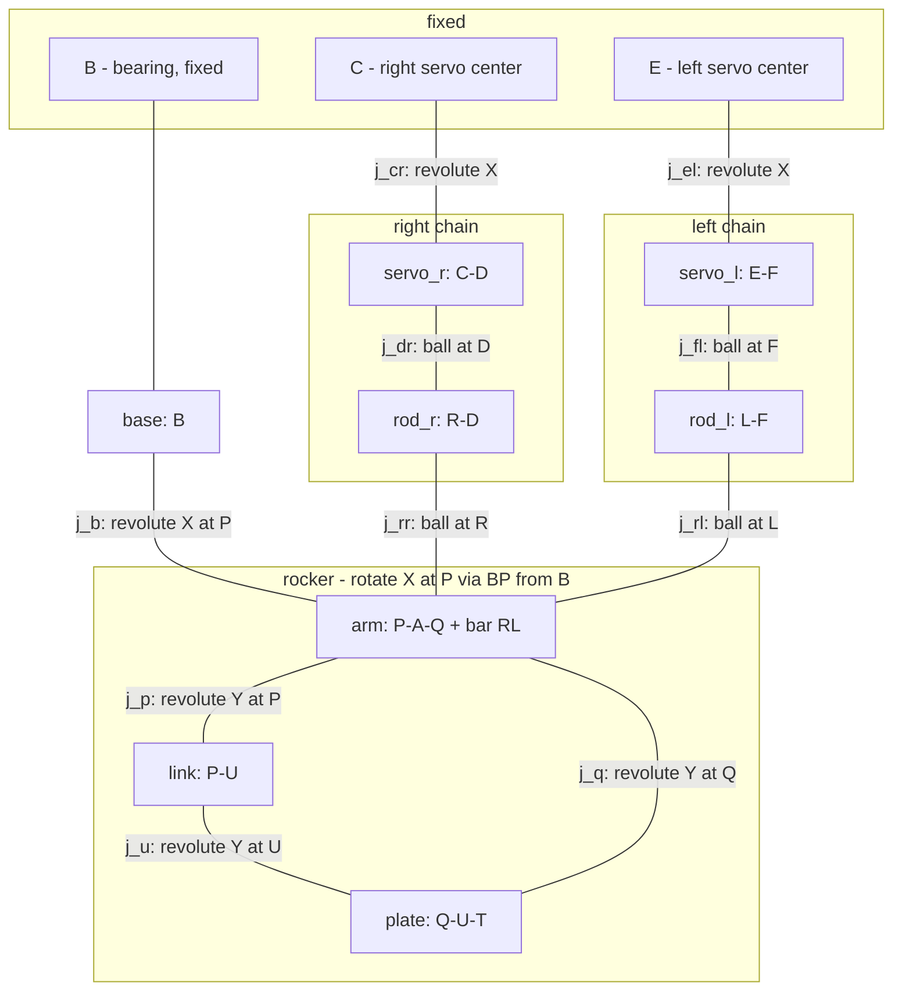

# 手指机构运动学分析

## 1. 固定点

B, C, E 在世界坐标系中固定不动。

| 点 | 位置 | 说明 |
|----|------|------|
| B | $(0, 0, z_0)$ | 轴承安装位置（固定） |
| P | $(L_{cp}, 0, z_0)$ | 三体共轴点（base/arm/link 在此连接） |
| C | $(x_e, +y_e, z_e)$ | 右舵机旋转中心 |
| E | $(x_e, -y_e, z_e)$ | 左舵机旋转中心 |

**P 点特殊性**：base、arm、link 三个刚体在 P 点共轴。
- base ↔ arm：X 轴旋转（轴承在 B，BP 杆传动到 P）
- arm ↔ link：Y 轴旋转
- base 自身可通过 B 处轴承绕 X 轴旋转

## 2. 刚体（8个）

| 刚体 | 包含点 | 形状 | 颜色 |
|------|--------|------|------|
| base | B | 轴承座（固定） | 灰 |
| arm | P, A, Q, R, L | 驱动臂（三角形PAQ + 横杆RL） | 蓝 |
| link | P, U | 直立连杆（杆） | 绿 |
| plate | Q, U, T | 手指板（三角形QUT） | 橙 |
| rod_r | R, D | 右连杆（杆） | 灰 |
| rod_l | L, F | 左连杆（杆） | 灰 |
| servo_r | C, D | 右舵机摇臂（杆） | 紫 |
| servo_l | E, F | 左舵机摇臂（杆） | 紫 |

## 3. 关节（10个）

### 旋转关节 Revolute（各 1 DOF）

| 关节 | 连接刚体 | 位置 | 轴 | 说明 |
|------|---------|------|----|------|
| j_b | base ↔ arm | P | X | base-arm，轴承在 B，通过 BP 杆传动到 P |
| j_p | arm ↔ link | P | Y | arm-link，仅 Y 轴旋转；link 的 X 轴旋转由 arm 带动 |
| j_u | link ↔ plate | U | Y | 臂内 link-plate 连接 |
| j_q | plate ↔ arm | Q | Y | 臂内 plate-arm 连接 |
| j_cr | servo_r 旋转 | C | X | 右舵机旋转 |
| j_el | servo_l 旋转 | E | X | 左舵机旋转 |

### 球关节 Ball（各 3 DOF）

| 关节 | 连接刚体 | 位置 | 说明 |
|------|---------|------|------|
| j_dr | servo_r ↔ rod_r | D | 右舵机摇臂 → 右连杆 |
| j_fl | servo_l ↔ rod_l | F | 左舵机摇臂 → 左连杆 |
| j_rr | rod_r ↔ arm | R | 右连杆 → 驱动臂 |
| j_rl | rod_l ↔ arm | L | 左连杆 → 驱动臂 |

## 4. 拓扑结构

### 闭环

1. **P-U-Q 三角闭环**（arm-link-plate）：3 个 revolute Y 关节，3 根刚性杆
2. **C-D-R-arm-C**（右舵机 → 连杆 → 驱动臂 → 回）：1 个 revolute + 2 个 ball
3. **E-F-L-arm-E**（左舵机 → 连杆 → 驱动臂 → 回）：1 个 revolute + 2 个 ball

## 5. 位置公式

### 旋转矩阵

$$R_x(\theta) = \begin{bmatrix} 1 & 0 & 0 \\ 0 & \cos\theta & -\sin\theta \\ 0 & \sin\theta & \cos\theta \end{bmatrix}$$

### 摇臂子系统

B 和 P 都在旋转轴线上（$y=0, z=z_0$），所以 $R_x(\theta)$ 在 B 或 P 处作用等价。当前代码以 P 为旋转中心计算。

P 点固定在旋转轴线上，位置不变：$P = (L_{cp},\ 0,\ z_0)$

$$A = P + R_x(\theta) \cdot (x_a,\ 0,\ z_a), \quad x_a = L_A \sin\alpha,\ z_a = L_A \cos\alpha$$

$$Q = P + R_x(\theta) \cdot (x_q,\ 0,\ z_q), \quad x_q = L_Q \sin\gamma,\ z_q = L_Q \cos\gamma$$

$$U = P + R_x(\theta) \cdot (0,\ 0,\ L_U)$$

$$T = P + R_x(\theta) \cdot (0,\ 0,\ L_U + L_T)$$

$$R = P + R_x(\theta) \cdot \left(x_a,\ \frac{L_B}{2},\ z_a\right)$$

$$L = P + R_x(\theta) \cdot \left(x_a,\ -\frac{L_B}{2},\ z_a\right)$$

**物理含义**：B 处轴承旋转 → BP 杆带动 P → P 处的 arm/link/plate 整体随动。

### 舵机子系统

$$D(\beta_1) = C + (0,\ R\cos\beta_1,\ R\sin\beta_1)$$

$$F(\beta_2) = E + (0,\ R\cos\beta_2,\ R\sin\beta_2)$$

## 6. 约束方程

### 连杆长度约束（刚性连杆，长度恒定）

$$f_1(\theta, \beta_1) = |R(\theta) - D(\beta_1)|^2 - L_{rod\_r}^2 = 0 \quad \text{（右连杆）}$$

$$f_2(\theta, \beta_2) = |L(\theta) - F(\beta_2)|^2 - L_{rod\_l}^2 = 0 \quad \text{（左连杆）}$$

### 展开 $f_1$（右连杆约束）

$$R(\theta) = P + R_x(\theta) \cdot \left(x_a,\ \tfrac{L_B}{2},\ z_a\right) = \left(L_{cp}+x_a,\ \ \tfrac{L_B}{2}\cos\theta - z_a\sin\theta,\ \ z_0 + \tfrac{L_B}{2}\sin\theta + z_a\cos\theta\right)$$

$$D(\beta_1) = \left(x_e,\ \ y_e + R\cos\beta_1,\ \ z_e + R\sin\beta_1\right)$$

$$\Delta x = L_{cp} + x_a - x_e$$

$$\Delta y = \tfrac{L_B}{2}\cos\theta - z_a\sin\theta - y_e - R\cos\beta_1$$

$$\Delta z = z_0 + \tfrac{L_B}{2}\sin\theta + z_a\cos\theta - z_e - R\sin\beta_1$$

$$f_1 = \Delta x^2 + \Delta y^2 + \Delta z^2 - L_{rod\_r}^2 = 0$$

### 展开 $f_2$（左连杆约束，对称）

$$L(\theta) = P + R_x(\theta) \cdot \left(x_a,\ -\tfrac{L_B}{2},\ z_a\right) = \left(L_{cp}+x_a,\ \ -\tfrac{L_B}{2}\cos\theta - z_a\sin\theta,\ \ z_0 - \tfrac{L_B}{2}\sin\theta + z_a\cos\theta\right)$$

$$F(\beta_2) = \left(x_e,\ \ -y_e + R\cos\beta_2,\ \ z_e + R\sin\beta_2\right)$$

$$\Delta x = L_{cp} + x_a - x_e$$

$$\Delta y = -\tfrac{L_B}{2}\cos\theta - z_a\sin\theta + y_e - R\cos\beta_2$$

$$\Delta z = z_0 - \tfrac{L_B}{2}\sin\theta + z_a\cos\theta - z_e - R\sin\beta_2$$

$$f_2 = \Delta x^2 + \Delta y^2 + \Delta z^2 - L_{rod\_l}^2 = 0$$

## 7. 自由度分析

### 变量

- $\theta$（摇臂转角）
- $\beta_1$（右舵机角度）
- $\beta_2$（左舵机角度）

### 约束

- $f_1 = 0$（右连杆长度恒定）
- $f_2 = 0$（左连杆长度恒定）

### 结果

$$\text{DOF} = 3 \text{ 个变量} - 2 \text{ 个约束} = 1$$

### 驱动策略

驱动 $\beta_1$ → 由 $f_1=0$ 解 $\theta$（一维求根）→ 由 $f_2=0$ 解 $\beta_2$（一维求根）→ 联动。

球关节（R, L, D, F）只传递距离约束，不传递力矩。给定 $\beta_1$ 时，$f_1=0$ 对 $\theta$ 最多有 **2 个解**（圆与球面的交点）。

## 8. 待确认问题

- [ ] **arm-link-plate 内部自由度**：P-U-Q 三角闭环有 3 个 revolute Y 关节 → 理论上 0 DOF（刚性）。实际机构是否有多余自由度？如果是，当前 compute 模型需要补充。
- [ ] **多解问题**：给定 $\beta_1$，可能存在 2 个有效 $\theta$ 值。物理机构走哪个分支？
- [ ] **解空间边界**：$\beta_1$ 在什么范围内有有效解？奇异点在哪里？
- [ ] **连杆长度**：左右两根连杆长度 $L_{rod\_r}$ 和 $L_{rod\_l}$ 是否相等？影响解空间对称性。
